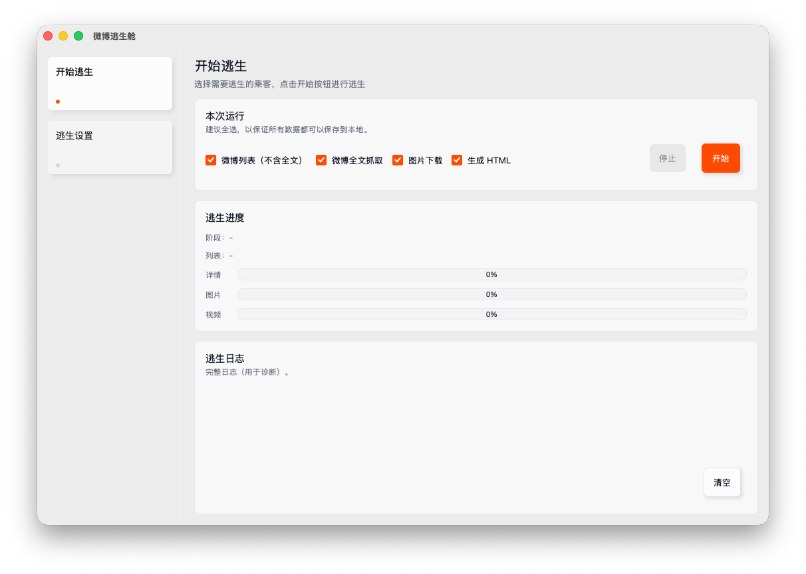

<div align="center">
  
  
  # 微博逃生舱 · Weibo Lifeboat 🚀
  
  **一个优雅的微博个人数据备份工具**
  
  **An elegant personal data backup tool for Weibo**
  
  [](LICENSE)
  [](https://www.python.org/downloads/)
  
  [English](#english) | [中文](#中文)
  
</div>

---

## 中文

<div align="center">

**🚀 一个优雅的微博个人数据备份工具**

采用现代异步架构 · 提供精美的 macOS 原生 GUI 界面和命令行工具

</div>

### ✨ 核心特性

- **全量抓取**：备份所有历史微博（文本、图片、视频）
- **断点续传**：支持中断后继续，不重复下载
- **异步高效**：使用异步 IO，支持高并发下载
- **精美展示**：生成 Apple 风格的 HTML 离线页面
- **数据持久化**：SQLite 数据库存储，方便查询和导出
- **双界面支持**：macOS 原生 GUI + 命令行工具

### 📸 界面预览



### 📦 系统要求

- **Python**: 3.9 或更高版本
- **操作系统**: macOS / Linux / Windows
- **依赖**: 见 `requirements.txt`

### 🛠 安装步骤

#### 1. 克隆项目

```bash
git clone https://github.com/yourusername/weibo-backup.git
cd weibo-backup
```

#### 2. 创建虚拟环境（推荐）

```bash
python3 -m venv .venv
source .venv/bin/activate  # macOS/Linux
# 或
.venv\Scripts\activate  # Windows
```

#### 3. 安装依赖

```bash
pip install -r requirements.txt
```

#### 4. 配置 Cookie

复制配置模板并填写你的信息：

```bash
cp config.example.json config.json
```

编辑 `config.json`，填入你的微博信息：

```json
{
  "weibo": {
    "user_id": "你的用户ID",
    "cookie": "你的Cookie",
    "user_agent": "浏览器User-Agent"
  }
}
```

**如何获取 Cookie：**

1. 打开 Chrome 浏览器
2. 访问 https://m.weibo.cn 并登录
3. 按 `F12` 打开开发者工具
4. 切换到 **Console** 标签
5. 输入 `document.cookie` 并回车
6. 复制输出的 Cookie 字符串

**如何获取 User ID：**

1. 登录微博后，访问你的主页
2. 查看 URL，格式为 `https://m.weibo.cn/u/1234567890`
3. 其中 `1234567890` 就是你的 User ID

### 🚀 使用方法

#### 快速启动（推荐）

```bash
# macOS/Linux 用户可以直接运行
./start.sh

# Windows 用户需要先激活虚拟环境
.venv\Scripts\activate
python run_gui.py
```

启动脚本会自动：
- ✅ 检查并创建虚拟环境
- ✅ 安装所需依赖
- ✅ 启动图形界面

#### 方式一：图形界面

```bash
python run_gui.py
```

启动后，你可以：
- 在 **开始逃生** 页面备份微博数据
- 在 **逃生设置** 页面管理配置和 Cookie

#### 方式二：命令行

```bash
python run.py
```

程序会自动执行：
1. 测试连接
2. 抓取微博数据
3. 下载图片和视频
4. 生成 HTML 页面

#### 查看结果

```bash
open data/output/index.html  # macOS
# 或
xdg-open data/output/index.html  # Linux
# 或直接在浏览器中打开该文件
```

### 📁 目录结构

```
weibo-backup/
├── assets/                 # 界面资源文件
├── config.json             # 配置文件（需要自行创建）
├── config.example.json     # 配置模板
├── requirements.txt        # Python 依赖
├── run_gui.py              # GUI 启动入口
├── run.py                  # 命令行启动入口
├── src/
│   ├── database.py         # 数据库模块
│   ├── weibo_fetcher.py    # 微博抓取模块
│   ├── media_downloader.py # 媒体下载模块
│   ├── html_generator.py   # HTML 生成模块
│   ├── main.py             # 命令行主程序
│   ├── gui/                # GUI 模块
│   └── pipeline/           # 数据处理管道
└── data/                   # 数据目录（运行后自动生成）
    ├── weibo.db            # SQLite 数据库
    ├── images/             # 下载的图片
    ├── videos/             # 下载的视频
    └── output/
        └── index.html      # 生成的 HTML 页面
```

### ⚙️ 配置说明

`config.json` 主要配置项：

```json
{
  "weibo": {
    "user_id": "你的用户ID",
    "cookie": "你的Cookie",
    "user_agent": "浏览器User-Agent"
  },
  "crawler": {
    "concurrent_requests": 5,
    "concurrent_downloads": 20,
    "request_delay": 1.0,
    "retry_times": 3,
    "timeout": 30
  },
  "storage": {
    "database_path": "data/weibo.db",
    "images_dir": "data/images",
    "videos_dir": "data/videos",
    "output_dir": "data/output"
  }
}
```

### 🎨 HTML 页面特性

生成的 HTML 备份页面：

- ✨ Apple 风格设计，简洁优雅
- 📱 响应式布局，支持手机/平板/电脑
- 🖼️ 图片网格展示，支持灯箱预览
- 🎬 内联视频播放器
- 📊 数据统计和时间轴
- 🔍 完全离线可用，无需网络

### ⚡ 性能说明

以 6000 条微博为例：

- **抓取时间**: 约 5-10 分钟
- **图片下载**: 约 2-4 小时（假设 10000 张）
- **视频下载**: 约 1-3 小时（假设 100 个）
- **存储空间**: 约 15-50 GB

### 🔄 断点续传

如果备份过程中断：

1. **不要删除** `data/weibo.db` 文件
2. 直接重新运行程序
3. 程序会自动从上次中断的地方继续

### ❓ 常见问题

**Q: Cookie 过期怎么办？**

A: 在 GUI 界面的设置页面点击"更新 Cookie"，或手动编辑 `config.json` 文件。数据不会丢失。

**Q: 会被微博封号吗？**

A: 程序有请求延迟和并发控制，模拟正常用户行为。正常使用不会触发反爬虫机制。

**Q: 可以备份别人的微博吗？**

A: 只能备份登录账号有权限查看的内容，无法突破隐私限制。

**Q: 删除功能安全吗？**

A: 本工具不提供删除功能，仅用于备份。如需删除微博，请使用微博官方功能。

**Q: 数据存储在哪里？**

A: 所有数据存储在 `data/` 目录下，包括数据库、图片、视频和生成的 HTML 文件。

### 🔐 隐私与安全

- **本地运行**：所有数据处理在本地完成，不上传到任何服务器
- **Cookie 安全**：`config.json` 已加入 `.gitignore`，不会被提交到 Git
- **开源透明**：所有代码开源，可以自行审查

### 🛡️ 免责声明

本工具仅供个人备份使用，请遵守微博服务条款和相关法律法规。使用本工具产生的任何后果由使用者自行承担。

### 🤝 贡献

欢迎提交 Issue 和 Pull Request！

### 📄 开源协议

本项目采用 MIT License - 查看 [LICENSE](LICENSE) 文件了解详情

---

**立即开始备份你的微博记忆！** 💙

---

## English

<div align="center">

**🚀 An elegant personal data backup tool for Weibo**

Built with modern asynchronous architecture · Beautiful macOS native GUI and CLI

</div>

### ✨ Key Features

- **Complete Backup**: Backup all historical Weibo posts (text, images, videos)
- **Resume Support**: Continue from where it left off, no duplicate downloads
- **Async & Efficient**: Built with async I/O for high-performance concurrent downloads
- **Beautiful Display**: Generate Apple-style offline HTML pages
- **Data Persistence**: SQLite database storage for easy queries and exports
- **Dual Interface**: macOS native GUI + command-line tool

### 📸 Screenshots


### 📦 Requirements

- **Python**: 3.9 or higher
- **OS**: macOS / Linux / Windows
- **Dependencies**: See `requirements.txt`

### 🛠 Installation

#### 1. Clone the Repository

```bash
git clone https://github.com/yourusername/weibo-backup.git
cd weibo-backup
```

#### 2. Create Virtual Environment (Recommended)

```bash
python3 -m venv .venv
source .venv/bin/activate  # macOS/Linux
# or
.venv\Scripts\activate  # Windows
```

#### 3. Install Dependencies

```bash
pip install -r requirements.txt
```

#### 4. Configure Cookie

Copy the configuration template and fill in your information:

```bash
cp config.example.json config.json
```

Edit `config.json` with your Weibo information:

```json
{
  "weibo": {
    "user_id": "Your User ID",
    "cookie": "Your Cookie",
    "user_agent": "Browser User-Agent"
  }
}
```

**How to Get Cookie:**

1. Open Chrome browser
2. Visit https://m.weibo.cn and log in
3. Press `F12` to open Developer Tools
4. Switch to **Console** tab
5. Type `document.cookie` and press Enter
6. Copy the output Cookie string

**How to Get User ID:**

1. After logging in, visit your profile page
2. Check the URL, format is `https://m.weibo.cn/u/1234567890`
3. `1234567890` is your User ID

### 🚀 Usage

#### Quick Start (Recommended)

```bash
# macOS/Linux users can run directly
./start.sh

# Windows users need to activate venv first
.venv\Scripts\activate
python run_gui.py
```

The start script will automatically:
- ✅ Check and create virtual environment
- ✅ Install required dependencies
- ✅ Launch the GUI

#### Method 1: GUI

```bash
python run_gui.py
```

After launching, you can:
- Backup Weibo data on the **Lifeboat** page
- Manage configuration and Cookie on the **Settings** page

#### Method 2: Command Line

```bash
python run.py
```

The program will automatically:
1. Test connection
2. Fetch Weibo data
3. Download images and videos
4. Generate HTML pages

#### View Results

```bash
open data/output/index.html  # macOS
# or
xdg-open data/output/index.html  # Linux
# or open the file directly in your browser
```

### 📁 Directory Structure

```
weibo-backup/
├── assets/                 # UI resource files
├── config.json             # Configuration file (create manually)
├── config.example.json     # Configuration template
├── requirements.txt        # Python dependencies
├── run_gui.py              # GUI entry point
├── run.py                  # CLI entry point
├── src/
│   ├── database.py         # Database module
│   ├── weibo_fetcher.py    # Weibo fetcher module
│   ├── media_downloader.py # Media downloader module
│   ├── html_generator.py   # HTML generator module
│   ├── main.py             # CLI main program
│   ├── gui/                # GUI module
│   └── pipeline/           # Data processing pipeline
└── data/                   # Data directory (auto-generated)
    ├── weibo.db            # SQLite database
    ├── images/             # Downloaded images
    ├── videos/             # Downloaded videos
    └── output/
        └── index.html      # Generated HTML page
```

### ⚙️ Configuration

Main `config.json` options:

```json
{
  "weibo": {
    "user_id": "Your User ID",
    "cookie": "Your Cookie",
    "user_agent": "Browser User-Agent"
  },
  "crawler": {
    "concurrent_requests": 5,
    "concurrent_downloads": 20,
    "request_delay": 1.0,
    "retry_times": 3,
    "timeout": 30
  },
  "storage": {
    "database_path": "data/weibo.db",
    "images_dir": "data/images",
    "videos_dir": "data/videos",
    "output_dir": "data/output"
  }
}
```

### 🎨 HTML Page Features

Generated HTML backup pages include:

- ✨ Apple-style design, clean and elegant
- 📱 Responsive layout, supports mobile/tablet/desktop
- 🖼️ Grid image gallery with lightbox preview
- 🎬 Inline video player
- 📊 Statistics and timeline
- 🔍 Fully offline, no network required

### ⚡ Performance

For 6000 Weibo posts:

- **Fetching**: ~5-10 minutes
- **Image Download**: ~2-4 hours (assuming 10000 images)
- **Video Download**: ~1-3 hours (assuming 100 videos)
- **Storage**: ~15-50 GB

### 🔄 Resume Support

If the backup process is interrupted:

1. **Do not delete** the `data/weibo.db` file
2. Simply restart the program
3. It will automatically continue from where it left off

### ❓ FAQ

**Q: What if the Cookie expires?**

A: Click "Update Cookie" on the Settings page in GUI, or manually edit `config.json`. Your data will not be lost.

**Q: Will my account be banned?**

A: The program has request delays and concurrency controls to simulate normal user behavior. Normal usage won't trigger anti-crawler mechanisms.

**Q: Can I backup someone else's Weibo?**

A: You can only backup content your logged-in account has permission to view. Cannot bypass privacy restrictions.

**Q: Is the delete function safe?**

A: This tool does not provide delete functionality, only backup. To delete Weibo posts, please use the official Weibo features.

**Q: Where is the data stored?**

A: All data is stored in the `data/` directory, including database, images, videos, and generated HTML files.

### 🔐 Privacy & Security

- **Local Processing**: All data processing is done locally, not uploaded to any servers
- **Cookie Security**: `config.json` is in `.gitignore`, won't be committed to Git
- **Open Source**: All code is open source for your review

### 🛡️ Disclaimer

This tool is for personal backup use only. Please comply with Weibo's Terms of Service and relevant laws and regulations. Users are responsible for any consequences of using this tool.

### 🤝 Contributing

Issues and Pull Requests are welcome!

### 📄 License

This project is licensed under the MIT License - see the [LICENSE](LICENSE) file for details

---

**Start backing up your Weibo memories now!** 💙
